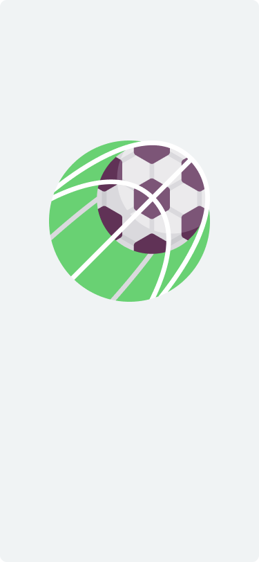
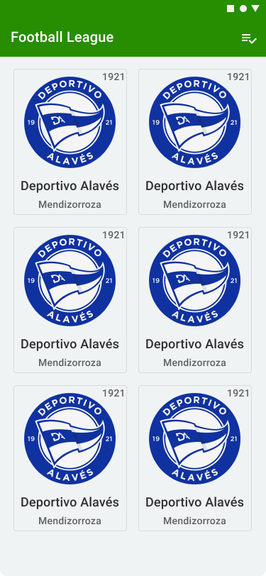
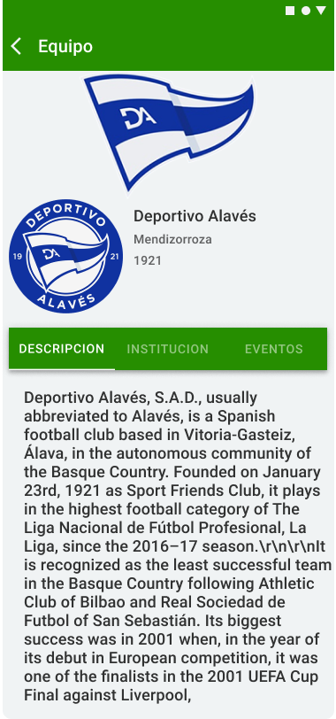
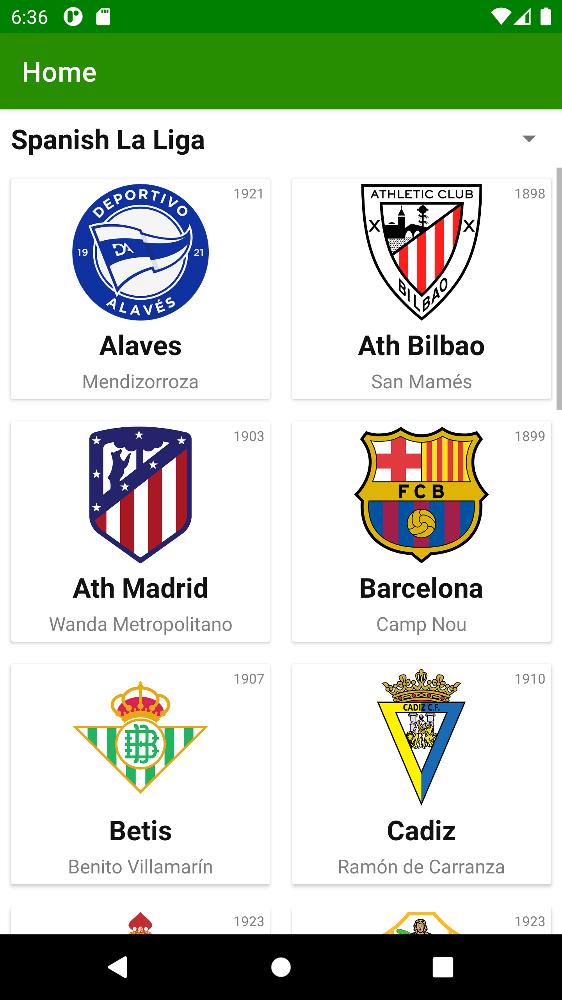

# FootballLeague

## Prueba Tecnica de Ingreso a Condor Labs

### Proceso Previo (Analisís)

- [x] Revision de la API

- [x] Diseño rapido de interfaces

- [x] Determinar cantidad de vistas y contenido

### Implementación de la Prueba

Para la implementacion de la prueba se usaron las siguientes especificaciones:

- Patron de Arquitectura: MVVM

- Libreria de Consumo de Servicios: Retrofit

- Libreria de Reactividad: Flow

- Libreria para gestion de Navegación: Navigation

- Implementacion de Patron repositorio

- Implementacion de Capa Datasource (Source)

### Bosquejo Diseño de Interfaces

Diseños previos creados en Figma para la idea general de la prueba

### Pantallazo Resultado Final

Pantallazos del Resultado Final de la Prueba

### Listado de Requisitos

1. Create an splash view that presents your app (please don't delay more than two seconds)

2. On the main view list all teams from ​“Spanish La Liga” ​league, showing the

following information from each one: Name, Stadium and Team badge

3. When a team is touched, I should go to a detail view where I should see:
    - Team name
    - Team description
    - Team foundation year
    - Team badge and jersey
    - Next 5 events of the team
    - If the team has webpage or social networks, I should see the links and be
      redirected when clicked

4. On the main view create a filter with 2 more leagues (you choose) and refresh the list of

teams depending of which league is selected

